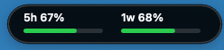

# Codex 灵动岛

macOS 顶部悬浮窗，用灵动岛样式显示 Codex 当前 5 小时和 1 周用量窗口的剩余百分比。

Codex Usage Island is a small macOS floating overlay that shows the remaining Codex usage for the 5-hour and 1-week rate-limit windows. It is designed for people who keep Codex running on a Mac mini or desktop Mac and want a quick, glanceable usage indicator without opening the Codex settings menu.



## 功能

- 显示 5 小时窗口剩余用量
- 显示 1 周窗口剩余用量
- 启动时立即刷新，之后每 60 秒刷新一次
- 点击展开详情，右键退出
- 支持安装为开机自启

## 数据来源

v1.0.2 起，应用优先读取 Codex 设置菜单同源的官方用量接口：

```text
https://chatgpt.com/backend-api/wham/usage
```

应用会从本机 `~/.codex/auth.json` 读取 Codex 登录令牌，只用于请求当前账号的用量状态。接口不可用时，才会退回读取本机 `~/.codex/sessions` 下 Codex 写入的 `rate_limits` 快照。

显示值和 Codex 设置菜单一致：`100 - used_percent`，即剩余百分比。

## Privacy / Security

- The app reads `~/.codex/auth.json` only to request the current account's Codex usage from the official Codex usage endpoint.
- The token is not uploaded to any third-party server.
- The token is not stored, cached, logged, or written to disk by this app.
- Usage data is displayed locally in the macOS overlay.
- If the official usage endpoint is unavailable, the app falls back to local Codex session snapshots under `~/.codex/sessions`.

## 下载

最新版安装包在 GitHub Releases：

https://github.com/ljbljb007/codex-lingdongdao/releases/latest

## 构建

```bash
./scripts/build.sh
```

构建产物会生成在 `dist/CodexUsageIsland.app`。

## 运行

```bash
open dist/CodexUsageIsland.app
```

## 自检

```bash
dist/CodexUsageIsland.app/Contents/MacOS/CodexUsageIsland --print-usage
```

## 安装开机自启

```bash
./scripts/install-launch-agent.sh
```

安装后会立即启动应用。

## 卸载开机自启

```bash
launchctl bootout "gui/$(id -u)" "$HOME/Library/LaunchAgents/local.codex.usage-island.plist"
rm "$HOME/Library/LaunchAgents/local.codex.usage-island.plist"
```

## License

MIT
